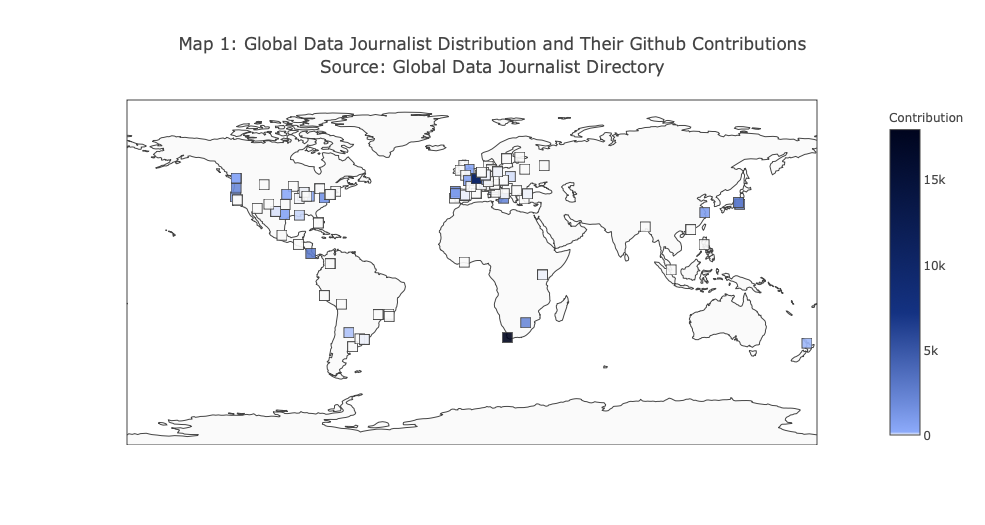

# Global Data Journalist Distribution and Their Overall Github Contribution from 2008
This is an example of scatter plots on maps. It's a report about how data journalists distribute all over the world.

Like the air crash map above, this map's key data that we should get is also the longitude and latitude of each cities. In  addition, we need another dimension to assign the color of each point on this map. In this case, the depth of color represents a journalist's overall github contribution from 2008.

The tools and process:

- Get the geographical data from the `geopy-raw.csv` file.
- Get the other information of a journalist from `journalists-data-including-github-contributions.csv`
- Use pandas to curate and restructure all the data source
- Use plotly to visualize the map
